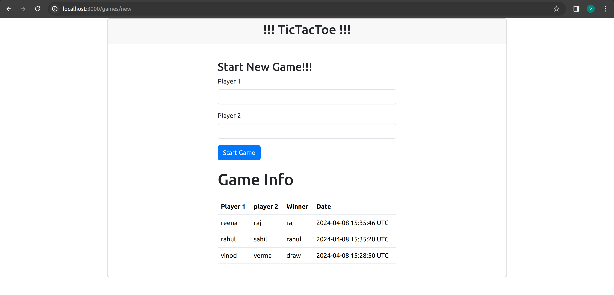

## About
    This is a Tic-Tac-Toe game application.
#### Prerequisites
- ruby 3.2.2
- rails 7.0.8
- Node 18+, and Yarn 1.x
#### Install
#### 1. Check out the repository
```bash
git clone https://github.com/ravendra-01/tic-tac-toe-game.git
```
##### 2. Create and setup the database
Run the following commands to install gems.
```ruby
bundle install
```
##### 3. Create and setup the database
Run the following commands to create and setup the database.
```ruby
rails db:create db:migrate db:seed
rails assets:precompile
```

##### 4. Start the Rails server

You can start the rails server using the command given below.

```ruby
rails s
`````

Now you can visit the site with the URL http://localhost:3000

- Screenshots


